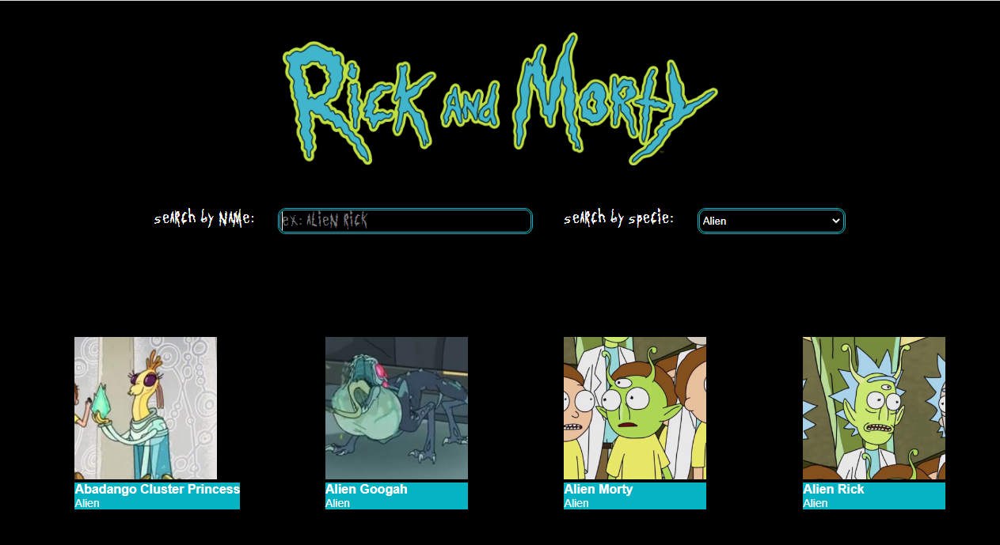

# Rick and Morty Characters

La creadora de este proyecto ha sido Nayra Romero - @nayraromero

## ¿En qué consiste?

En este proyecto se muestra en una página principal algunos de los personajes de la serie Rick y Morty, con algunos de sus datos más básicos como su nombre y su especie. En esta página existen dos buscadores para poder afinar la búsqueda de nuestro personaje por su nombre y/o especie.
Por otra parte, también podemos hacer click sobre cualquiera de los personajes, donde nos aparecerá otra página con más datos en detalle. En esta segunda página encontraremos también la opción de volver a la página principal.

## Lenguajes utilizados para el proyecto

Este proyecto ha sido creado con React. Aunque también se han utilizado otras tecnologías como:

1. HTML
2. CSS
3. React
4. Git y Github Pages
5. Uso de APIs.

## API

La API utilizada para este proyecto la he obtenido de: https://rickandmortyapi.com/documentation/#get-all-characters
